This project is an attempt to temporarily fix dotnet/maui#11088 . This project also provides pickers experience across almost all platforms: WinUI, Android, iOS and Mac Catalyst. So far from my test, ~~**no permission is needed** since you only have access to specific files that user picks.~~ you only need to declare permission on MacOS, no other permission is needed on other platforms.

See [demo project](./LukeMauiFilePicker.Demo/) with sample text editor app: **Opening a single file**, **Opening multiple files** (concatenate all the content) and **Saving into a file** (location and name picked by user).

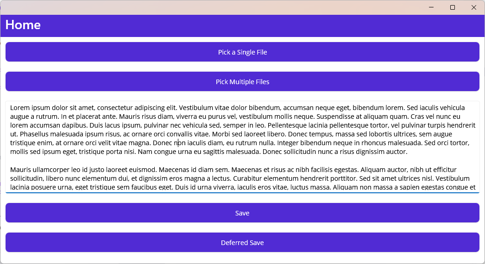

This article uses Windows screenshots. To see screenshots for other platforms, see [Screenshots on all platforms](#screenshots-on-all-platforms)

Was it helpful for you? Please consider a donation ❤️ [PayPal](https://paypal.me/datvm).

# Installation & Setup

## Nuget Package

Install the [NuGet package `LukeMauiFilePicker`](https://www.nuget.org/packages/LukeMauiFilePicker) into your .NET MAUI project:

```ps
dotnet add package LukeMauiFilePicker
```

## Setup Dependency Injection

In your `Program.cs` file, add the following line to the `CreateMauiApp()` method:

```cs
// Add IFilePickerService service to your DI
builder.Services.AddFilePicker();
```

> **Note**  
> If you use Android Save Picker, you need to add the code below to register Activity Result flow.

```cs
// You need this if you use Android Save Picker
// Optional Activity Result Request code, default is 2112 if not specified
builder.ConfigureFilePicker(100);
```

> **Warning**  
> If you do not call `ConfigureFilePicker()`, an `InvalidOperationException` will be thrown if you invoke Android Save Picker.

## MacOS Permissions

On MacOS, you need to declare the following permissions in your `Info.plist` file. Choose one of the following options based on your needs:

```xml
<key>com.apple.security.files.user-selected.read-write</key>
<true/>
<key>com.apple.security.files.user-selected.read-only</key>
<true/>
```

# Usage

The following methods can be called from an `IFilePickerService` instance from your DI.

## Open File Picker (Pick Single and Multiple Files)

```cs
Task<IPickFile?> PickFileAsync(string title, Dictionary<DevicePlatform, IEnumerable<string>>? types);
Task<IEnumerable<IPickFile>?> PickFilesAsync(string title, Dictionary<DevicePlatform, IEnumerable<string>>? types, bool multiple);
```

Pick a single file or multiple files. The `types` parameter is a dictionary of platform-specific file types. If you do not specify the `types` parameter, all file types are allowed.


Windows Open Multiple Files Picker

**Example:**

```cs
    static readonly Dictionary<DevicePlatform, IEnumerable<string>> FileType = new()
    {
        {  DevicePlatform.Android, new[] { "text/*" } } ,
        { DevicePlatform.iOS, new[] { "public.json", "public.plain-text" } },
        { DevicePlatform.MacCatalyst, new[] { "public.json", "public.plain-text" } },
        { DevicePlatform.WinUI, new[] { ".txt", ".json" } }
    };

    // Let user pick files (and handling cancelling)
    var files = await picker.PickFilesAsync("Select a file", FileType, true);
    if (files is null || !files.Any()) { return; }

    // Read the files
    foreach (var f in files)
    {
        using var s = await f.OpenReadAsync();
        using var reader = new StreamReader(s);

        str.AppendLine(await reader.ReadToEndAsync());
    }
```

> **Note**  
> On some platforms that [official MAUI File picker](https://learn.microsoft.com/en-us/dotnet/maui/platform-integration/storage/file-picker) works, the library simply calls those APIs.

The `IPickFile` interface lets you know the `FileName` and openning a `Stream` to a file. Optionally, you can also get the original `FileResult` from MAUI API if this library doesn't have custom implementation for it.

> **Warning**  
> On some platforms, when user cancel (pressing Back button), `PickFilesAsync` returns an empty array instead of `null` so you need to check for `Any()` as well.

> **Note**  
> For iOS and Mac Catalyst, you can put in either `Identifier` (`public.json`), `MimeType` (`application/json`) or file `Extension` (`json`). The library attempt to call 3 create methods `CreateFromIdentifier`, `CreateFromMimeType`, `CreateFromExtension` one after another. If all 3 methods fail, `UTTypes.Item` is used.

# Save File Picker

```cs
Task<bool> SaveFileAsync(SaveFileOptions options);
```

Save a file. The `SaveFileOptions` contains the following properties:

- `string SuggestedFileName` (**Required**): The suggested file name.

- `Stream Content` (**Required**): The content to write to. Note that this is required before user even pick a file because for iOS and Mac, it needs to be available before user picks a file.

- `(string FileTypeName, List<string> FileTypeExts) WindowsFileTypes`: Windows-specific file types. The `FileTypeName` is the name of the file type (can be any descriptive text), and `FileTypeExts` is a list of file extensions. If you do not specify this, the default is `All Files (*.*)`.

- `string AndroidMimeType`: Android-specific MIME type. If you do not specify this, the default is `application/octet-stream`.

The method returns `bool` to indicate if the user successfully picked a file and saved the content.

> **Note**  
> There is no specific iOS and Mac Catalyst option but this feature works for them.

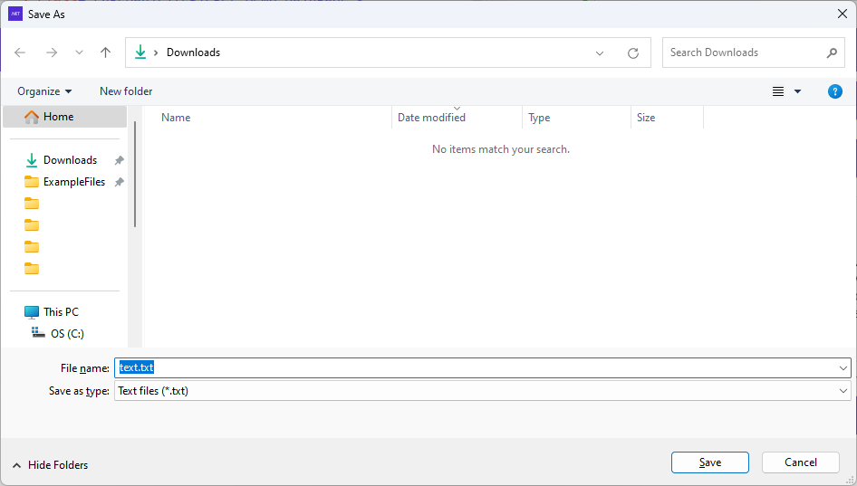

**Example:**

```cs
var bytes = Encoding.UTF8.GetBytes(TextEditor.Text ?? "");
using var memory = new MemoryStream(bytes);

await picker.SaveFileAsync(new("text.txt", memory)
{
    AndroidMimeType = "text/plain",
    WindowsFileTypes = ("Text files", new() { ".txt", })
});
```

> **Warning**  
> As specified on [Setup Dependency Injection](#setup-dependency-injection), you need to call `ConfigureFilePicker()` to register Activity Result flow if you use Android Save Picker.

# Screenshots on all platforms

## App UI


Windows App

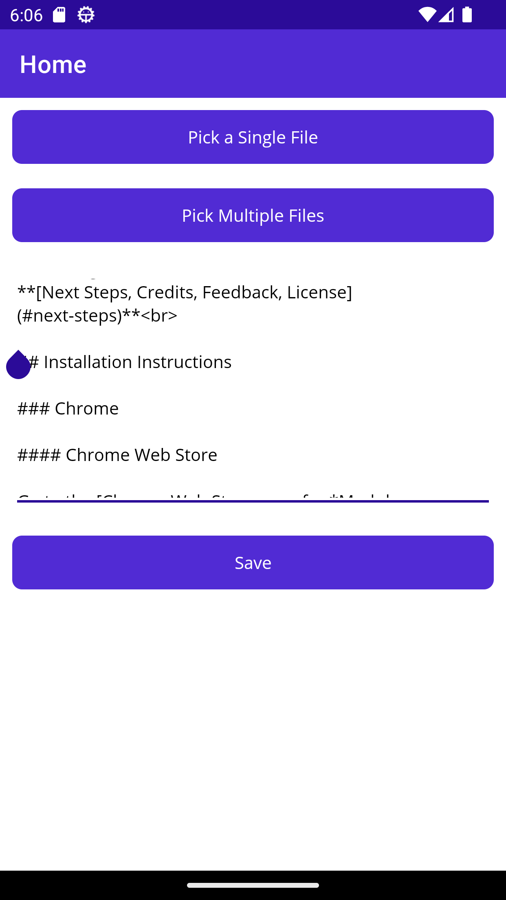
Android App

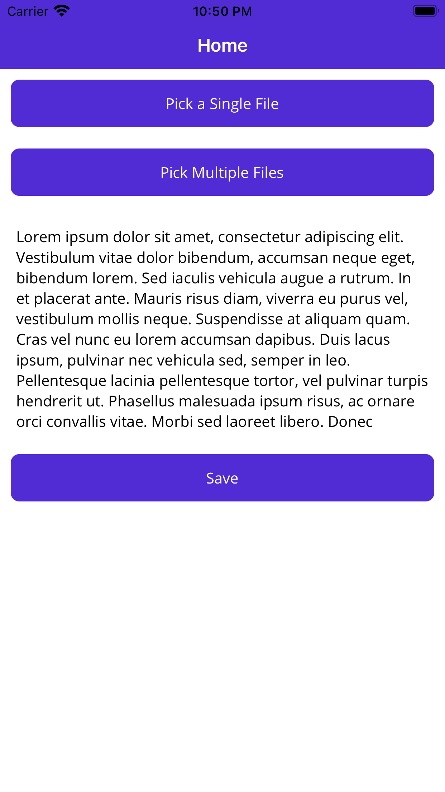
iOS App

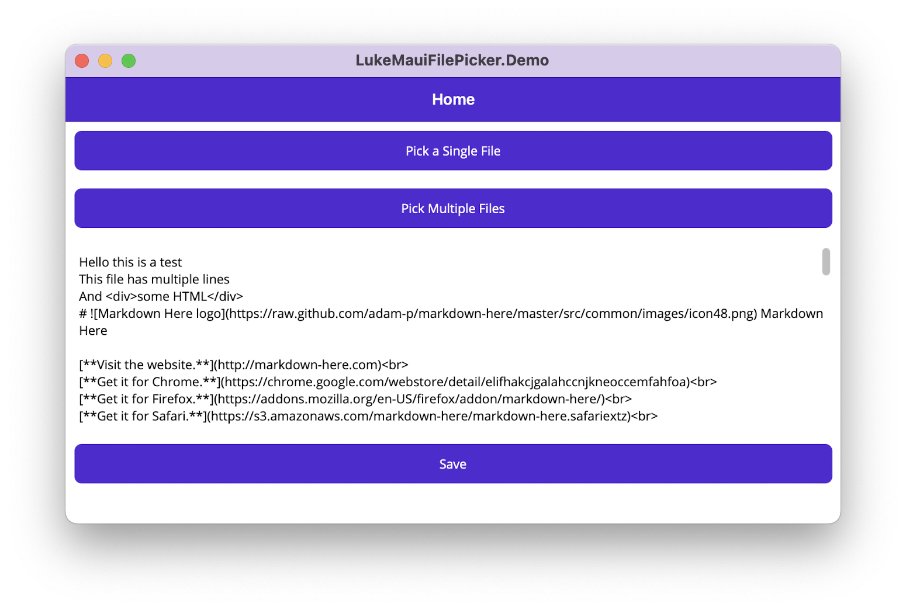
Mac Catalyst App

## Open File Picker - Single File

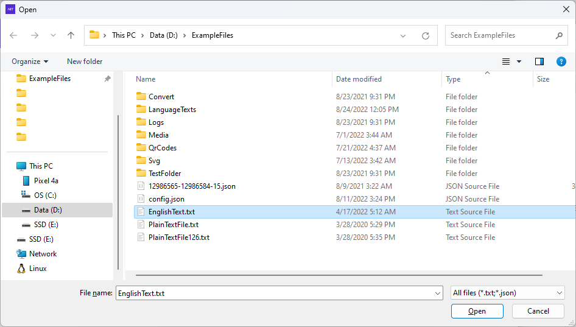
Windows Open Single File Picker

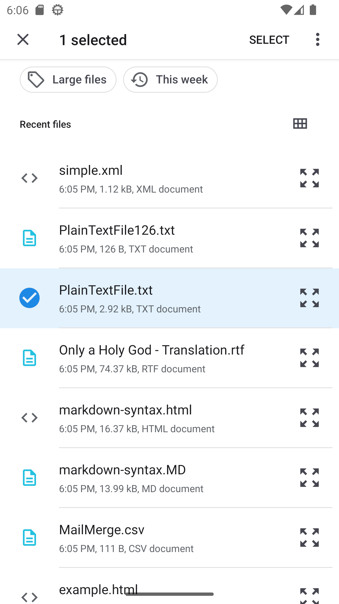
Android Open Single File Picker

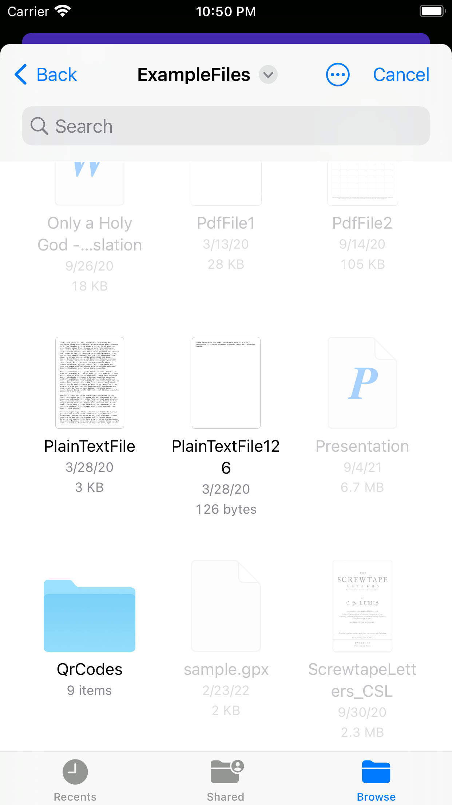
iOS Open Single File Picker

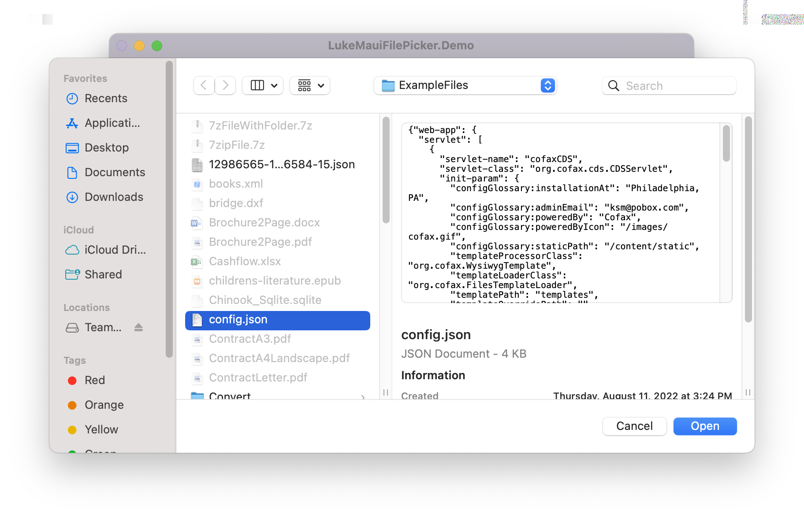
Mac Catalyst Open Single File Picker

## Open File Picker - Multiple Files


Windows Open Multiple Files Picker

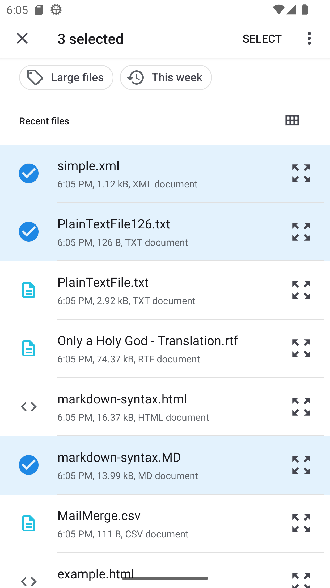
Android Open Multiple Files Picker


iOS Open Multiple Files Picker

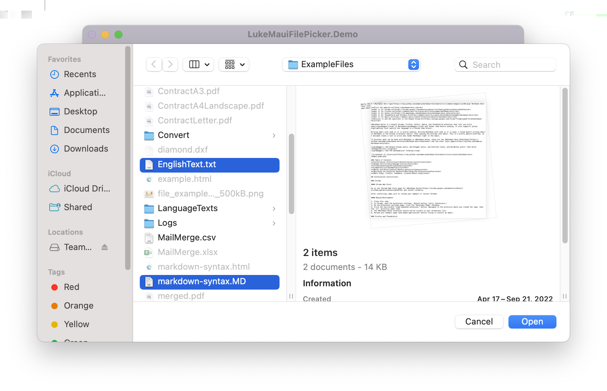
Mac Catalyst Open Multiple Files Picker

## Save File Picker


Windows Save File Picker

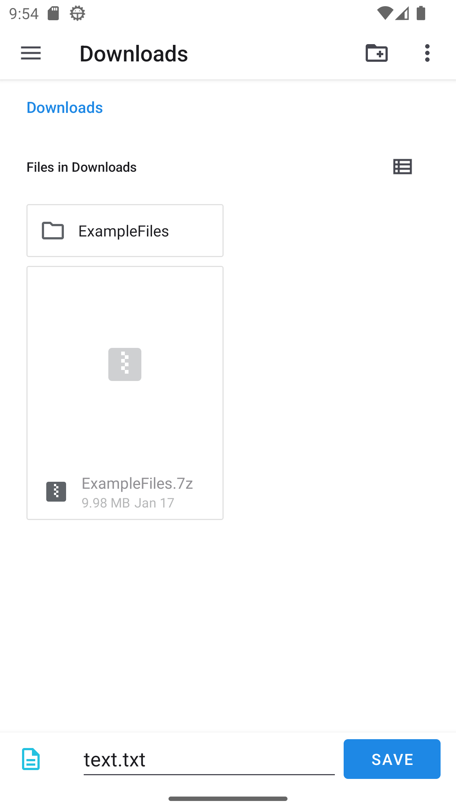
Android Save File Picker

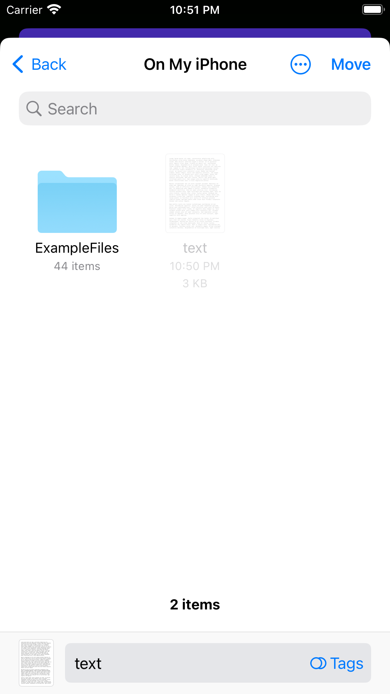
iOS Save File Picker

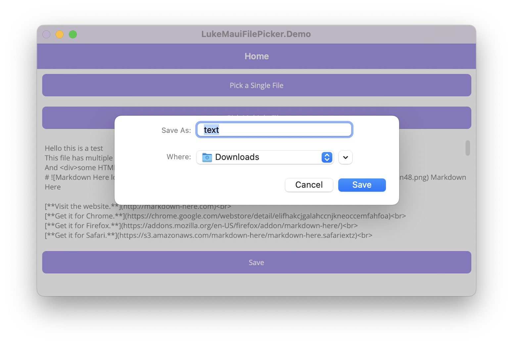
Mac Catalyst Save File Picker
